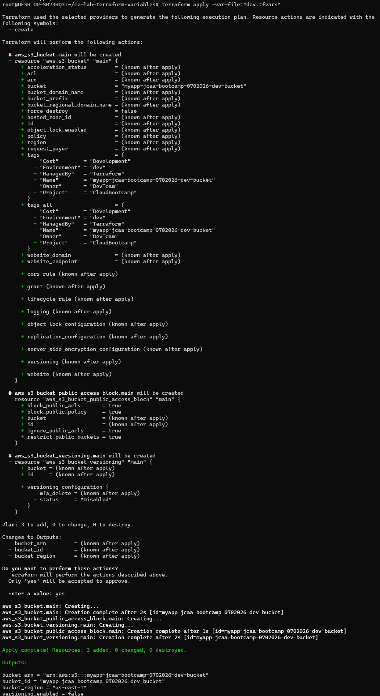
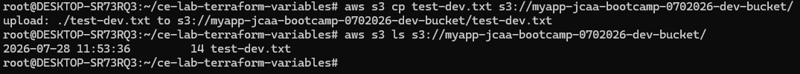
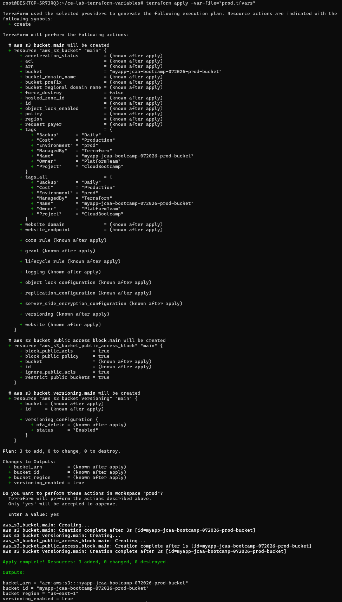
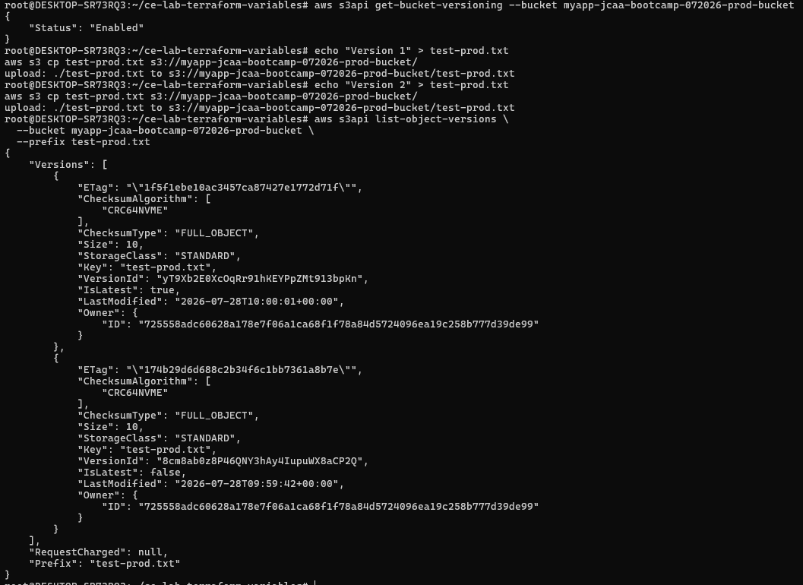
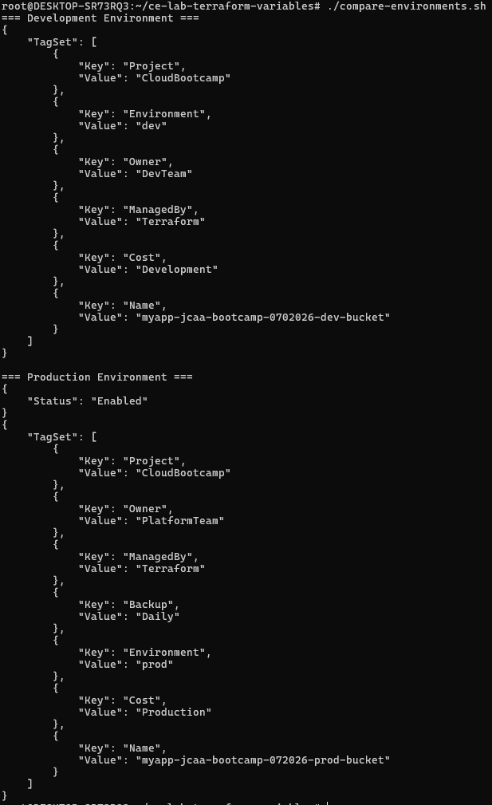
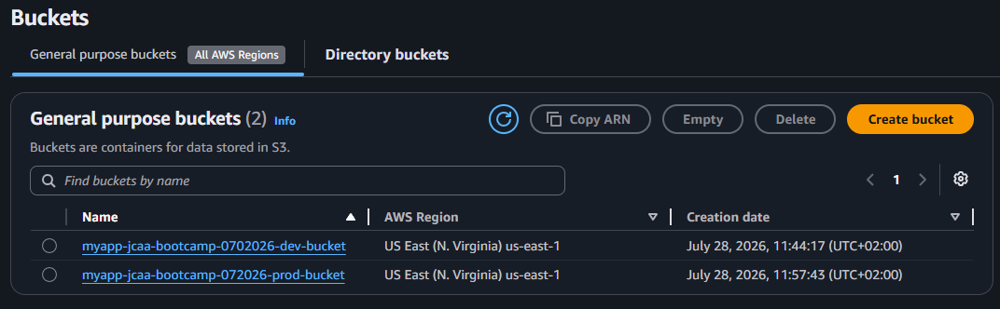

# Lab M4.02 - Terraform Variables & Parameterization
 
## Overview

Multi-environment S3 bucket deployment using Terraform variables.
 
## Environments

- **Dev:** myapp-jcaa-bootcamp-0702026-dev-bucket (no versioning)
- **Prod:** myapp-jcaa-bootcamp-072026-prod-bucket (versioning enabled)
 
## Usage
 
### Deploy Dev

```bash
terraform apply -var-file="dev.tfvars"
```

Output: 


 

Verify Dev Development: 


 
 
 
### Deploy Prod

```bash
terraform workspace select prod
terraform apply -var-file="prod.tfvars"
```

Output: 




Verify Prod Development: 



### Comparison 


 
## AWS Console verification

 
 
## Variables

- `environment`: dev/staging/prod
- `bucket_prefix`: Bucket name prefix
- `enable_versioning`: Enable S3 versioning
- `aws_region`: AWS region
- `tags`: Resource tags
 
## Outputs

- `bucket_id`: Bucket name
- `bucket_arn`: Bucket ARN
- `versioning_enabled`: Versioning status
